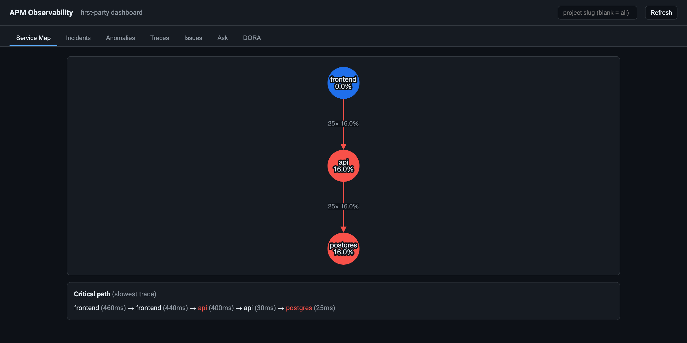
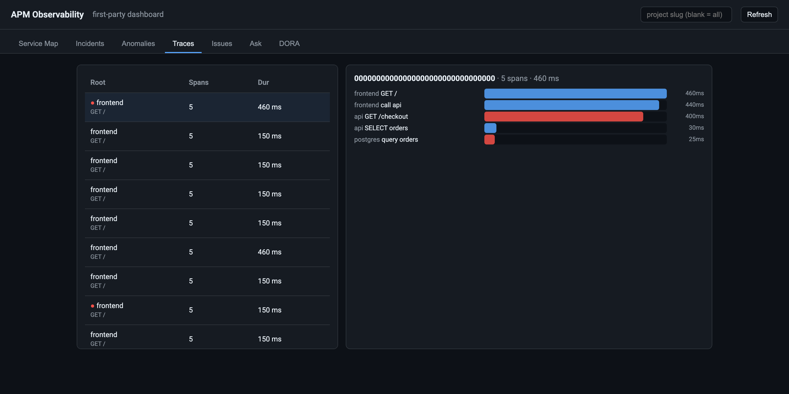
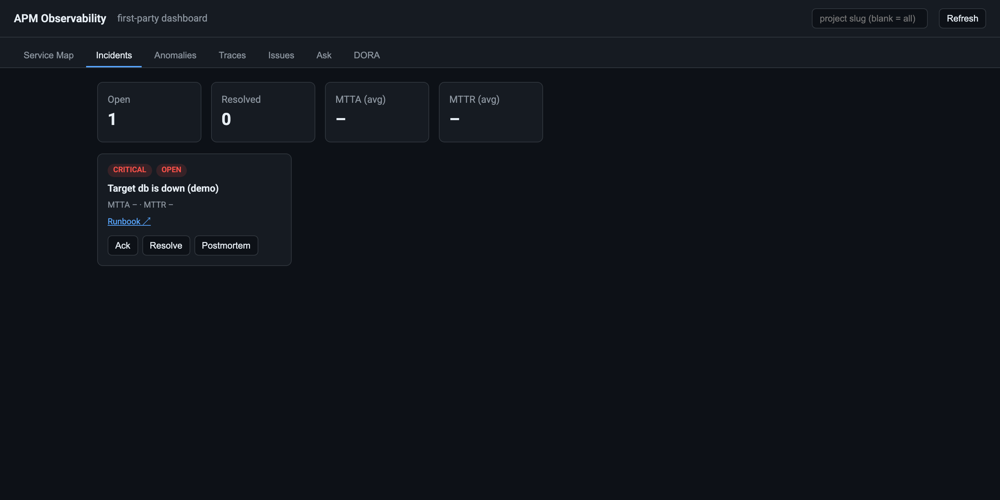
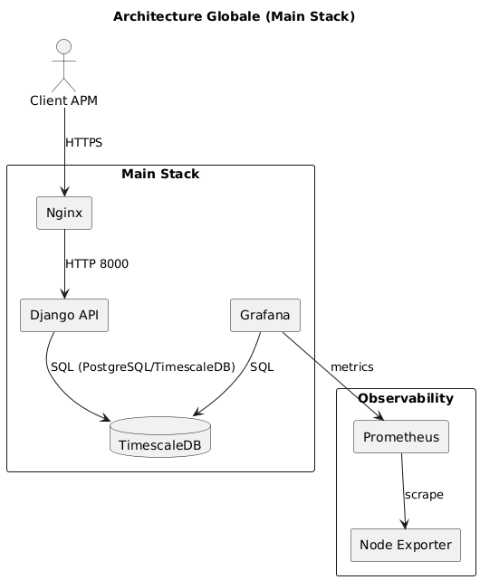

# APM Observability Platform

[](https://github.com/NawfalRAZOUK7/apm-observability/actions/workflows/ci.yml)
[](https://github.com/NawfalRAZOUK7/apm-observability/actions/workflows/codeql.yml)
[](https://github.com/NawfalRAZOUK7/apm-observability/actions/workflows/trivy.yml)
[](https://github.com/NawfalRAZOUK7/apm-observability/actions/workflows/gitleaks.yml)
[](https://github.com/NawfalRAZOUK7/apm-observability/actions/workflows/terraform.yml)
[](https://github.com/NawfalRAZOUK7/apm-observability/actions/workflows/policy.yml)
[](https://github.com/NawfalRAZOUK7/apm-observability/actions/workflows/docs.yml)
[](https://github.com/NawfalRAZOUK7/apm-observability/actions/workflows/helm.yml)
[](https://codecov.io/gh/NawfalRAZOUK7/apm-observability)
[](https://securityscorecards.dev/viewer/?uri=github.com/NawfalRAZOUK7/apm-observability)
[](LICENSE)
[](https://www.python.org/)

A **multi-tenant, OpenTelemetry-native observability platform** — the three
pillars (metrics, logs, traces) on TimescaleDB, with per-tenant API keys and
RBAC, real alerting and incident management, a first-party dashboard, an AI
assist layer, and a full platform-engineering delivery chain: Infrastructure as
Code, secrets management, policy-enforced supply chain, progressive delivery, and
DORA metrics.

Built as a Django/DRF service on PostgreSQL + TimescaleDB + pgvector. **Every
feature runs at $0 by default** via a provider pattern (each external dependency
has a free/local driver selectable by env var).

## Quick demo

```bash
make demo            # full stack (TimescaleDB + metrics/logs/traces) + seed + URLs
make demo-features   # seed a tenant + API key, send OTLP traces, fire a test alert
# open http://localhost:8000/dashboard/   ← the first-party UI
make loadtest        # drive traffic with k6 and watch dashboards/alerts react
make demo-down       # tear it all down
```

Requires Docker + Compose ≥ 2.24. The stack runs PostgreSQL + TimescaleDB — the
platform's single backend — everywhere (dev, CI, prod), so behaviour is identical.

## Capabilities

### Observability & product

| Area | What it does |
|---|---|
| **Three pillars** | Metrics (Prometheus), logs (Loki), traces (OpenTelemetry + Tempo) in one Grafana |
| **Native OTLP ingestion** | OTLP/HTTP **and gRPC** (`:4317`), JSON **and protobuf**, for traces + metrics + logs; tail sampling + per-tenant ingest rate limiting |
| **Multi-tenancy** | Organization → Project → Environment, hashed/rotatable API keys, JWT auth, RBAC, per-project quotas, PostgreSQL **Row-Level Security** |
| **Service maps** | Dependency topology from span edges, per-edge rate/error/latency, critical path |
| **Anomaly detection** | Robust (median/MAD) baselines per service+endpoint; pluggable embeddings (free local Ollama or Gemini) |
| **Alerting & incidents** | Real Alertmanager delivery (Slack/Discord/ntfy/email), tenant-defined alert rules + scheduler, incidents with MTTA/MTTR, runbooks, postmortems |
| **First-party dashboard** | Service-map graph, incident board, anomaly explorer, trace waterfall, issues, NL query, DORA — at `/dashboard/` |
| **AI assist** | AI-drafted postmortems, Sentry-style error grouping, natural-language telemetry queries (all with $0 fallbacks) |

### Platform engineering & delivery

| Area | What it does |
|---|---|
| **Infrastructure as Code** | Terraform/OpenTofu — local `kind` env ($0) + reference AWS (VPC/EKS/RDS/S3); fmt/validate/tflint/tfsec **+ Infracost cost-diff** on PRs, keyless AWS auth via GitHub OIDC ([`infra/terraform`](infra/terraform)) |
| **Secrets management** | External Secrets Operator, Sealed Secrets, or SOPS+age; no plaintext in git, enforced by gitleaks ([`infra/secrets`](infra/secrets)) |
| **Policy & supply chain** | Kyverno admission policies incl. **Cosign signature verification** at admit; images are signed (SBOM + provenance) in CI ([`infra/policy`](infra/policy)) |
| **Progressive delivery** | Argo Rollouts canary with Prometheus **metric analysis** — auto-promote or auto-rollback ([docs](docs/PROGRESSIVE_DELIVERY.md)) |
| **CD** | Tag → staging → smoke → approval → production → smoke → rollback; Helm + ArgoCD GitOps |
| **DORA metrics** | Deployment frequency, lead time, change-failure rate, MTTR — Elite/High/Medium/Low bands, in the API + Grafana + dashboard |
| **Reliability / DR** | pgBackRest backups + automated **restore verification** (RPO/RTO metrics) + chaos drills |

> The full phase-by-phase build log is in [`docs/ROADMAP.md`](docs/ROADMAP.md).

## Dashboard

The first-party UI at `/dashboard/` (single-file React, served by Django — no
build step) turns the whole platform into one pane of glass:



*Tabs: Service Map (dependency graph) · Incidents (ack/resolve, MTTA/MTTR) ·
Anomalies · Traces (waterfall) · Issues (grouped errors) · Ask
(natural-language queries) · DORA (delivery scorecard).*

Distributed traces are broken down span by span, so a slow dependency is one
click away:



Alertmanager webhooks land as incidents with ack/resolve, MTTA/MTTR and a
generated postmortem:



> Bring it up with `make demo` → `make demo-features`, then open
> `https://localhost:8443/dashboard/` (nginx terminates TLS with a self-signed
> cert, so expect a browser warning). The container also publishes port 8000,
> but Django redirects plain HTTP to HTTPS there and only Gunicorn is listening.

## Architecture



A Django/DRF core ingests telemetry (custom REST **and** native OTLP) into
TimescaleDB hypertables with continuous aggregates. Tenancy is enforced by
Row-Level Security. Prometheus/Loki/Tempo provide the pillars; Alertmanager feeds
a notification sink that opens incidents. Delivery is GitOps (Helm + ArgoCD) with
Kyverno policy gates and Argo Rollouts canaries, provisioned by Terraform.

## Key API surface

```
/api/requests/…                custom REST ingestion + analytics (KPIs, top endpoints)
/v1/traces  /v1/metrics /v1/logs   native OTLP ingestion (HTTP+gRPC, JSON+protobuf)
/api/tenancy/…                 JWT auth, projects, API keys, usage
/api/service-map/  /api/traces/<id>/   topology + trace waterfall
/api/anomalies/  /api/issues/  /api/nl-query/   anomaly, error groups, NL query
/api/alerting/rules/           tenant-defined alert rules
/api/dora/…                    delivery metrics
/sink/  /sink/incidents/…      notification sink + incident workflow
/api/docs/                     OpenAPI (Swagger UI) · /dashboard/  first-party UI
```

## Running it

**Local (Docker Compose).**

```bash
make certs-dev
make demo            # or: docker compose --env-file .env.docker -f docker/docker-compose.yml up -d --build
```

**Kubernetes (Helm + GitOps).**

```bash
helm install apm deploy/helm/apm-observability -n apm --create-namespace
kubectl apply -f deploy/argocd/application.yaml       # or declaratively via ArgoCD
```

**Infrastructure as Code (Terraform).**

```bash
cd infra/terraform/environments/local   # free local kind cluster
terraform init && terraform apply
```

See [`infra/README.md`](infra/README.md), [`deploy/README.md`](deploy/README.md),
and [`docs/PROGRESSIVE_DELIVERY.md`](docs/PROGRESSIVE_DELIVERY.md) for details.

## Security & supply chain

- Images built in CI are scanned (Trivy), get a CycloneDX **SBOM** and a signed
  **SLSA build-provenance** attestation, and are **signed with Cosign** (keyless);
  Kyverno **verifies those signatures at admission**.
- Secrets never live in git (empty chart defaults, gitleaks CI, External
  Secrets/Sealed Secrets/SOPS at deploy). CI authenticates to AWS via **GitHub
  OIDC** (short-lived tokens, no stored cloud keys — see
  [`infra/terraform/modules/github_oidc`](infra/terraform/modules/github_oidc)).
- Pods run non-root with dropped capabilities (restricted Pod Security Standard);
  optional default-deny NetworkPolicy.
- CodeQL static analysis, `pip-audit`, and **Dependabot** (pip, Actions, Docker,
  Terraform) keep dependencies patched.

## Testing

```bash
python manage.py test        # unit/API suite (128 tests)
bash scripts/run_all_tests.sh
coverage run manage.py test && coverage report   # enforced in CI (see .coveragerc)
```

CI runs the suite as a **matrix** — Python 3.12/3.13 × PostgreSQL 15/16 (with the
TimescaleDB extension, the one backend — no SQLite path, so tests exercise the
real engine) — plus a Docker Compose build-migrate-test smoke, and enforces a
coverage floor as a required gate.

## Documentation

- [`docs/ROADMAP.md`](docs/ROADMAP.md) — full capability + implementation history (Phases 1–18).
- [`docs/ARCHITECTURE.md`](docs/ARCHITECTURE.md) — components and repo structure.
- [`docs/adr/`](docs/adr) — architecture decision records.
- [`docs/runbooks/`](docs/runbooks) — operational runbooks (TargetDown, DR, secret rotation).
- [`docs/PROGRESSIVE_DELIVERY.md`](docs/PROGRESSIVE_DELIVERY.md) — canary + analysis.
- [`infra/README.md`](infra/README.md) — IaC, policy, secrets index.
- [`docs/report/`](docs/report) — original academic report and section write-ups.

> The docs in [`docs/`](docs) are also published as a **MkDocs Material site** to
> GitHub Pages on every push to `main` (see the Docs badge above).

## Project files

[`CONTRIBUTING.md`](CONTRIBUTING.md) ·
[`CODE_OF_CONDUCT.md`](CODE_OF_CONDUCT.md) ·
[`SECURITY.md`](SECURITY.md) ·
[`CHANGELOG.md`](CHANGELOG.md) ·
[MIT License](LICENSE)

---

Originally built for the APM Observability project (IDATA 3A 2025/2026) and
extended into a full platform-engineering showcase.
