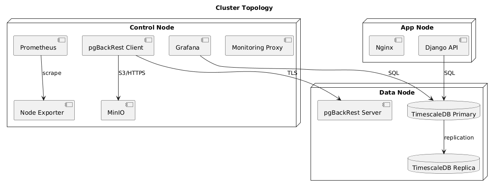
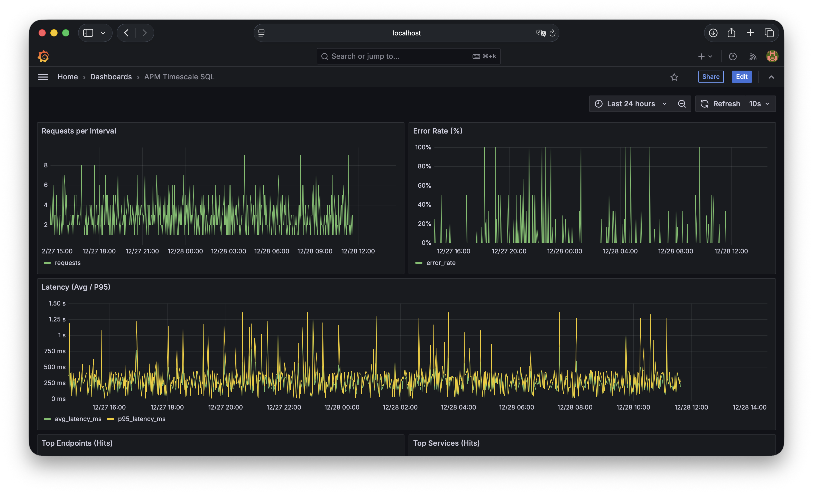

# APM Observability (PostgreSQL + TimescaleDB)

[](https://github.com/NawfalRAZOUK7/apm-observability/actions/workflows/ci.yml)
[](https://github.com/NawfalRAZOUK7/apm-observability/actions/workflows/codeql.yml)
[](https://github.com/NawfalRAZOUK7/apm-observability/actions/workflows/trivy.yml)
[](LICENSE)
[](https://www.python.org/)

APM Observability is a Django-based APM backend built on PostgreSQL + TimescaleDB,
with optional pgvector embeddings, pgBackRest backups (hot/cold), and a full
monitoring stack (Prometheus + Grafana). It supports a local single-node setup
and a multi-node cluster layout (DATA / CONTROL / APP).

## Quick demo (one command)
```
make demo       # FULL stack (TimescaleDB + 3 pillars), seed data, print URLs
make loadtest   # drive traffic with k6 and watch dashboards/alerts react
make demo-down  # tear everything down
```
`make demo` prints the URLs for the API, interactive docs, Grafana, Prometheus,
and Alertmanager once the stack is healthy. On machines that cannot pull all
Docker Hub images, use `make demo-lite` (SQLite, no TimescaleDB/nginx/collector;
analytics endpoints return 501 in that mode). Requires Docker Compose ≥ 2.24.

## Highlights
- Time-series storage with TimescaleDB hypertables and continuous aggregates.
- Read/write routing with primary + replicas.
- Hot/cold backups with pgBackRest + MinIO (S3-compatible).
- Three pillars of observability: metrics (Prometheus), logs (Loki), and
  distributed traces (OpenTelemetry + Tempo) — all in one Grafana.
- Alerting with Alertmanager, including SLO error-budget burn-rate alerts.
- Time-series data lifecycle: TimescaleDB compression + retention policies, plus a
  `check_data_quality` command usable as a CI gate.
- Optional Gemini embeddings with pgvector and semantic search.
- Multiple delivery paths: Docker Compose, Ansible, and a Helm chart with ArgoCD
  GitOps for Kubernetes.
- Auto-generated OpenAPI docs (Swagger UI + ReDoc) via drf-spectacular.
- k6 load-test suite that drives metrics and fires alerts (performance gate).
- Ansible-based deployment automation.
- CI (lint, tests, compose smoke, pip-audit) + CD (GHCR build/push, SBOM, Cosign signing).

## Screenshots
Architecture overview:


Data flow (ingestion to analytics):


Cluster topology:


Grafana dashboard:


## Quick Start (single-machine cluster)
This is the recommended local mode that mirrors the multi-node design.

Prerequisites:
- Docker + Docker Compose
- Python 3.12 (optional for local management commands)

1) Create a local cluster config (gitignored):
```
cp configs/cluster/cluster.example.yml configs/cluster/cluster.yml
```

2) Generate local TLS assets (not committed):
```
make certs-dev
```

3) Generate the cluster env + Prometheus targets:
```
python scripts/cluster/switch_cluster_mode.py --config configs/cluster/cluster.yml
```

4) Bring up the stacks:
```
make up-data
make up-control
make up-app
```

5) Seed data and validate:
```
make seed
make validate
```

6) Monitoring:
```
make grafana
make prometheus
make targets
```

For the full runbook, see `docs/PRISE_EN_MAIN.md`.

## Main Stack (single-node, minimal)
```
make certs-dev
docker compose --env-file .env.docker -f docker/docker-compose.yml up -d --build
```

This mode uses `docker/monitoring/prometheus/prometheus.simple.yml`, which scrapes
Docker service names directly (`web:8000`, `postgres-exporter:9187`,
`node-exporter:9100`). Grafana provisioning is mounted automatically, so the
Prometheus datasource and dashboards are available on first boot.

## Configuration
- `.env.docker` - web app defaults.
- `docker/cluster/.env.cluster` - cluster runtime configuration.
- `docker/.env.ports.localdev` - local port overrides.
- `configs/cluster/cluster.yml` - local config used by the switcher (gitignored).
- `docker/monitoring/prometheus/prometheus.simple.yml` - single-node scrape targets.
- `docker/monitoring/prometheus/prometheus.cluster.yml` - cluster scrape targets, rewritten by `scripts/cluster/switch_cluster_mode.py`.
- `make certs-dev` - regenerates local self-signed TLS and pgBackRest mTLS assets.
- `cp docker/backup/pgpass.example docker/backup/pgpass && chmod 600 docker/backup/pgpass` - prepares local pgBackRest DB auth.

## Backups (pgBackRest)
- Hot repository: `pgbackrest` bucket (MinIO).
- Cold repository: `pgbackrest-cold` bucket (MinIO).

Common commands:
```
make pgbackrest-info
make pgbackrest-check
make pgbackrest-full
make pgbackrest-full-repo2
```

Backup scheduling is defined in `docker/backup/pgbackrest-cron.sh`.

## Monitoring (TLS)
Grafana and Prometheus are exposed over HTTPS via a TLS proxy on CONTROL:
- `https://<CONTROL_NODE_IP>:3000` (Grafana)
- `https://<CONTROL_NODE_IP>:9090` (Prometheus)

The app Nginx is also HTTPS-only. Self-signed certs are used for local dev.

Alertmanager is available on port `9093`. Alert rules live in
`docker/monitoring/prometheus/alert.rules.yml`, and Alertmanager routing lives in
`docker/monitoring/alertmanager/alertmanager.yml`.

## Dependencies
Top-level Python dependencies are kept in `requirements.in`; the pinned lockfile
used by Docker and CI is `requirements.txt`.

Regenerate the lockfile after dependency changes:
```
make compile-deps
```

## AI Embeddings (Gemini + pgvector)
Optional semantic search is supported via Gemini embeddings.

Setup:
- Create `.env.gemini` (ignored) with `GEMINI_API_KEY=...`
- Ensure DB has pgvector: `docker/db/Dockerfile` + `docker/initdb/002_pgvector.sql`

Backfill embeddings:
```
python manage.py embed_apirequests --status-from 500 --limit 1000 --batch-size 16
```

Semantic search endpoint:
```
GET /api/requests/semantic-search/?q=timeout&limit=10
```

## Ansible Deployment
Ansible playbook and roles live in `infra/ansible/`.

Validate (local or remote):
```
ansible-playbook infra/ansible/site.yml --tags validate -e run_validation=true
```

## Kubernetes (Helm + GitOps)
A Helm chart and an ArgoCD Application live in `deploy/`.
```
helm lint deploy/helm/apm-observability
helm install apm deploy/helm/apm-observability --namespace apm --create-namespace
# or, declaratively, via ArgoCD:
kubectl apply -f deploy/argocd/application.yaml
```
See `deploy/README.md` for kind/minikube setup, overrides, and the GitOps flow.

## Data lifecycle & quality
- Migration `0009_retention_compression` enables TimescaleDB columnar compression
  (default: chunks older than `APM_COMPRESS_AFTER_DAYS=7`) and a retention policy
  (`APM_RETENTION_DAYS=90`) on the raw hypertable, while the continuous aggregates
  keep the long-term history.
- Data-quality gate (nulls, ranges, duplicate trace_ids, freshness):
```
python manage.py check_data_quality --max-age-minutes 60 --fail-on-empty
```

## API documentation (OpenAPI)
The API is self-documented via `drf-spectacular`. Once the stack is running:
- Swagger UI: `http://localhost:8000/api/docs/`
- ReDoc: `http://localhost:8000/api/redoc/`
- Raw OpenAPI schema: `http://localhost:8000/api/schema/`

Generate the schema to a file:
```
python manage.py spectacular --file openapi.yml
```

## Load testing (k6)
A [k6](https://k6.io/) suite drives the API end-to-end and makes the observability
stack react (dashboards fill, alerts fire). It doubles as a performance gate via
thresholds.
```
make demo        # start the stack first
make loadtest    # BASE_URL/BATCH/ERROR_RATIO overridable
```
See `loadtest/README.md` for details and what to watch while it runs.

## Observability: the three pillars
- **Metrics** — Prometheus scrapes the app (`/metrics`, via django-prometheus and
  custom metrics), node-exporter, and postgres-exporter. Dashboards are
  provisioned in Grafana.
- **Logs** — the app emits structured JSON logs (with `trace_id`/`span_id`);
  Promtail ships container logs to Loki, queryable in Grafana.
- **Traces** — Django is instrumented with OpenTelemetry; spans are exported via
  OTLP to an OpenTelemetry Collector and stored in Tempo. Grafana links traces to
  logs (Tempo → Loki) and logs to traces (Loki → Tempo).

Tracing is opt-in via `OTEL_ENABLED` and is off during tests/CI. The `make demo`
stack turns it on automatically. Explore everything in Grafana
(`http://localhost:33000`): the Prometheus, TimescaleDB, Tempo, and Loki
datasources are all provisioned.

## Testing
- Unit/API tests: `python manage.py test`
- Step scripts: `scripts/tests/step1_test.sh` ... `scripts/tests/step6_test.sh`
- Full suite: `bash scripts/run_all_tests.sh`

Test evidence is stored under `reports/`.

## Documentation
- `docs/PRISE_EN_MAIN.md` - step-by-step runbook.
- `docs/ARCHITECTURE.md` - repo structure and component roles.
- `docs/ROADMAP.md` - feature roadmap and implementation status.
- `docs/sections/` - project writeups mapped to assignment sections.

## Contributing & project files
- [`CONTRIBUTING.md`](CONTRIBUTING.md) - dev setup, quality gates, PR workflow.
- [`CODE_OF_CONDUCT.md`](CODE_OF_CONDUCT.md) - community guidelines.
- [`SECURITY.md`](SECURITY.md) - how to report vulnerabilities.
- [`CHANGELOG.md`](CHANGELOG.md) - notable changes.

## License
Released under the [MIT License](LICENSE).

## Troubleshooting
- Re-generate cluster env: `python scripts/cluster/switch_cluster_mode.py --config configs/cluster/cluster.yml`
- Rebuild stacks: `make up-data`, `make up-control`, `make up-app`
- Wipe cluster containers/volumes: `make down-all`

If a container is unhealthy, wait 20-30 seconds and re-run `make up-data`.

---

Maintained for the APM Observability project (IDATA 3A 2025/2026).
