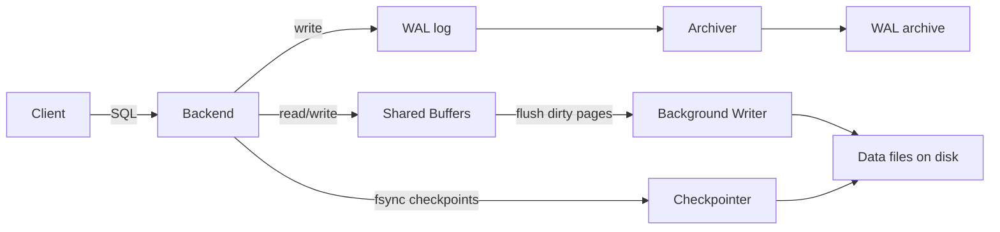

# Postgres processes (backend, WAL, bgwriter)

```mermaid
flowchart LR
  Client -->|SQL| Backend
  Backend -->|write| WAL[WAL log]
  Backend -->|read/write| Buffers[Shared Buffers]
  Buffers -->|flush dirty pages| BGW[Background Writer]
  BGW --> DataFiles[Data files on disk]
  Backend -->|fsync checkpoints| Checkpointer
  Checkpointer --> DataFiles
  WAL --> Archiver
  Archiver --> WALArchive[WAL archive]
```
