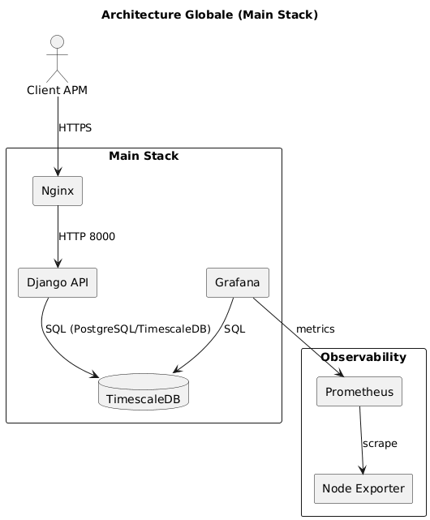
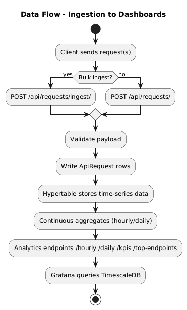
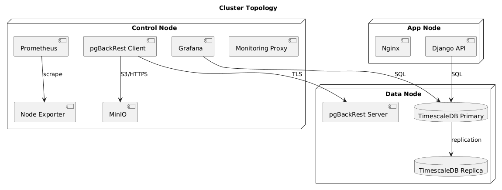

# Architecture

## Scope
This document explains the role/intent of the repository structure used by the APM
Observability project. It covers tracked, active assets in detail.

Local or generated artifacts are called out, but not enumerated file-by-file:
- `__pycache__/`, `.venv/`, `*.pyc`, `*.log`, `*.sqlite3`
- local secrets in `.env*` (except `.env.example` + `.env.docker`)
- `configs/cluster/cluster.yml` (local, gitignored)
- large legacy archive under `archive/`

## Runtime Architecture (Logical)
- APP node: Django app + Nginx TLS reverse proxy.
- DATA node: TimescaleDB primary + replicas, pgBackRest server, postgres-exporter.
- CONTROL node: MinIO (S3 hot/cold), pgBackRest client/cron, Prometheus, Grafana,
  node-exporter, and a TLS proxy for Grafana/Prometheus.
- Main stack (single-node): `docker/docker-compose.yml` for local dev.

## Architecture visuals
Architecture overview:

Data flow (ingestion to analytics):

Cluster topology:

## Repository Layout

### Root (top level)
- `.github/` - GitHub Actions workflows + Dependabot config.
- `apm_platform/` - Django project settings and routing.
- `observability/` - Main Django app (API, analytics, AI embeddings).
- `docker/` - Docker images, compose stacks, certs, monitoring configs.
- `configs/` - Cluster-mode configuration templates.
- `infra/` - Ansible deployment automation.
- `scripts/` - Helper scripts, drills, test runners.
- `postman/` - Postman collections + environments for testing.
- `docs/` - Project documentation.
- `reports/` - Test evidence artifacts (committed runs).
- `archive/` - Legacy/archived assets and experiments (not used in active flows).
- `Dockerfile` - Web app container build.
- `Makefile` - Convenience targets for cluster/app/backup/monitoring/tests.
- `manage.py` - Django CLI entry point.
- `requirements.txt` - Python dependencies (runtime + dev tools).
- `pyproject.toml` - Ruff/Black/tooling configuration.
- `.env.example` - Example environment file for local dev.
- `.env.docker` - Docker runtime environment defaults for web app.
- `railway.json` - Railway deployment config.
- `check_railway_db.sh` - Script to verify Railway DB connectivity.
- `setup_railway_env.sh` - Script to export Railway env vars.
- `deploy-production.sh` - Production deployment helper.
- `.env` / `.env.gemini` - Local-only secret files (ignored by git).

### .github/
- `.github/dependabot.yml` - Dependabot update rules.
- `.github/workflows/ci.yml` - Consolidated CI pipeline (lint/test/compose/audit).
- `.github/workflows-archive/ci-compose.yml` - Archived CI Compose workflow.
- `.github/workflows-archive/ci-lint.yml` - Archived CI Lint workflow.
- `.github/workflows-archive/ci-security.yml` - Archived CI Security workflow.
- `.github/workflows-archive/ci-tests.yml` - Archived CI Tests workflow.

### apm_platform/ (Django project)
- `__init__.py` - Package marker.
- `asgi.py` - ASGI entry point.
- `wsgi.py` - WSGI entry point.
- `settings.py` - Primary Django settings.
- `ci_settings.py` - CI-only overrides (single DB, no SSL redirect).
- `urls.py` - Root URL routing.
- `db_middleware.py` - Tracks request method and marks writes.
- `db_routing.py` - Read-after-write TTL + safe method detection.
- `db_router.py` - Primary/replica DB router logic.
- `__pycache__/` - Python cache (generated, ignored).

### observability/ (Django app)
- `__init__.py` - Package marker.
- `admin.py` - Django admin configuration.
- `apps.py` - Django app config.
- `filters.py` - API filtering logic.
- `guards.py` - Safety/validation helpers for requests and queries.
- `models.py` - Timescale/pgvector-backed data models.
- `serializers.py` - DRF serializers for ingest and read APIs.
- `urls.py` - App-level routes.
- `views.py` - API endpoints (ingest, KPIs, search).
- `ai/`
  - `__init__.py` - AI package marker.
  - `gemini.py` - Gemini embeddings client + helpers.
- `analytics/`
  - `__init__.py` - Analytics package marker.
  - `sql.py` - SQL snippets for KPIs + analytics queries.
- `management/`
  - `__init__.py` - Django management package marker.
  - `commands/`
    - `__init__.py` - Commands package marker.
    - `check_cluster_dbs.py` - Probe primary/replica routing.
    - `embed_apirequests.py` - Backfill embeddings into pgvector.
    - `refresh_apirequest_daily.py` - Refresh daily CAGG.
    - `refresh_apirequest_hourly.py` - Refresh hourly CAGG.
    - `seed_apirequests.py` - Seed synthetic request data (ORM or API).
- `migrations/`
  - `0001_initial.py` - Base schema.
  - `0002_timescale.py` - TimescaleDB setup.
  - `0003_hourly_cagg.py` - Hourly continuous aggregate.
  - `0004_daily_cagg.py` - Daily continuous aggregate.
  - `0005_step5_indexes.py` - Seed-related indexes.
  - `0006_remove_apirequest_api_req_time_desc_idx.py` - Index cleanup.
  - `0007_task7_indexes.py` - Performance indexes.
  - `0008_embeddings.py` - pgvector embeddings storage.
  - `__init__.py` - Migrations package marker.
- `tests/`
  - `__init__.py` - Tests package marker.
  - `utils.py` - Test helpers.
  - `test_crud.py` - Basic CRUD tests.
  - `test_daily.py` - Daily CAGG checks.
  - `test_filters.py` - API filter behavior.
  - `test_hourly.py` - Hourly CAGG checks.
  - `test_ingest_mixed_non_strict.py` - Ingest validation (mixed).
  - `test_ingest_strict.py` - Strict ingest validation.
  - `test_ingest_valid.py` - Valid ingest payloads.
  - `test_kpis.py` - KPI endpoints.
  - `test_legacy.py` - Legacy behaviors/backcompat.
  - `test_smoke.py` - Minimal smoke tests.
  - `test_top_endpoints.py` - Endpoint ranking tests.

### configs/
- `configs/cluster/cluster.example.yml` - Template for single/multi cluster config.
- `configs/cluster/cluster.yml` - Local cluster config (gitignored).

### docker/
- `.env.ports` - Active port mappings.
- `.env.ports.example` - Example port mapping template.
- `.env.ports.localdev` - Local single-host port overrides.
- `docker-compose.yml` - Main stack (single host).
- `docker-compose.backup.yml` - Backup stack (MinIO + pgBackRest).
- `entrypoint.sh` - Web container entrypoint.
- `backup/`
  - `db-init.sh` - DB init service (extensions + SQL).
  - `pgbackrest-client.conf` - pgBackRest client config.
  - `pgbackrest-cron.sh` - Cron schedule runner.
  - `pgbackrest-server.conf` - pgBackRest server config.
  - `pgpass` - Local pgpass for non-interactive auth.
- `certs/`
  - `setup-ssl.sh` - Generate self-signed app TLS certs.
  - `gen_pgbackrest_mtls.sh` - Generate pgBackRest mTLS certs.
  - `public.crt` - App TLS public cert (local).
  - `private.key` - App TLS private key (local).
  - `pgbackrest/` - pgBackRest client/server certs (local).
- `cluster/`
  - `.env.cluster` - Cluster env (DATA/CONTROL/APP).
  - `.env.cluster.example` - Cluster env template.
  - `docker-compose.app.yml` - APP stack (web + nginx).
  - `docker-compose.data.yml` - DATA stack (db + replicas + exporter).
  - `docker-compose.control.yml` - CONTROL stack (minio, pgbackrest, monitoring).
  - `pgbackrest-db.conf` - DB-side pgBackRest config.
  - `replica/`
    - `primary-setup.sh` - Primary replication bootstrap.
    - `replica-entrypoint.sh` - Replica init/entrypoint.
- `db/`
  - `Dockerfile` - TimescaleDB image with pgvector + pgBackRest.
- `initdb/`
  - `000_timescaledb.sql` - TimescaleDB extension.
  - `001_roles.sql` - Writer/reader roles.
  - `002_pgvector.sql` - pgvector extension.
- `minio/`
  - `Dockerfile` - MinIO image with cert handling.
  - `gen-minio-cert.sh` - Self-signed MinIO certs.
  - `init.sh` - Bucket init (hot/cold).
- `monitoring/`
  - `prometheus.yml` - Scrape targets and TLS settings.
  - `grafana/provisioning/`
    - `dashboards/dashboards.yml` - Dashboard provisioning.
    - `dashboards/apm-infra.json` - Infra dashboard.
    - `dashboards/apm-targets.json` - Targets dashboard.
    - `dashboards/apm-timescale.json` - Timescale SQL dashboard.
    - `datasources/datasources.yml` - Prometheus data source.
  - `nginx/conf.d/monitoring.conf` - TLS proxy for Grafana/Prometheus.
- `nginx/`
  - `nginx.conf` - Nginx base config.
  - `conf.d/default.conf` - TLS reverse proxy for Django app.
- `pgbackrest/`
  - `Dockerfile` - pgBackRest client/server image.
  - `entrypoint.sh` - pgBackRest entrypoint.

### infra/ansible/
- `ansible.cfg` - Ansible config.
- `site.yml` - Main playbook (data/control/app).
- `inventory/hosts.ini` - Host inventory (single or multi node).
- `group_vars/all.yml` - Shared settings.
- `group_vars/data.yml` - Data node vars.
- `group_vars/control.yml` - Control node vars.
- `group_vars/app.yml` - App node vars.
- `templates/env.cluster.j2` - Rendered `.env.cluster`.
- `roles/`
  - `docker_engine/tasks/main.yml` - Docker install/validate.
  - `repo_assert/tasks/main.yml` - Repo presence checks.
  - `env_cluster/tasks/main.yml` - Generate `.env.cluster`.
  - `stack_data/tasks/main.yml` - Deploy data stack.
  - `stack_control/tasks/main.yml` - Deploy control stack.
  - `stack_app/tasks/main.yml` - Deploy app stack.
  - `validate/tasks/main.yml` - Post-deploy validation.

### scripts/
- `run_all_tests.sh` - Orchestrates step1..step6 tests.
- `seed_faker.sh` - Quick seed helper for API requests.
- `step1_test.sh` - Step 1 functional checks.
- `step2_test.sh` - Step 2 cluster connectivity checks.
- `step3_test.sh` - Step 3 roles/routing checks.
- `step4_test.sh` - Step 4 backups/pgBackRest checks.
- `step5_test.sh` - Step 5 seed + analytics checks.
- `step6_test.sh` - Step 6 failure/recovery drills checks.
- `init_postgres_local.sh` - Local DB bootstrap helper.
- `db_quick_demo.sql` - Quick SQL demo dataset.
- `gen_pgbackrest_cipher_pass.sh` - Generate cipher pass.
- `collect_minio_init_logs.sh` - Extract MinIO init logs.
- `ansible/validate.sh` - Run Ansible validation + log.
- `cluster/switch_cluster_mode.py` - Switch single/multi node config.
- `dev/bootstrap.sh` - Bootstrap stack (single-node defaults).
- `dev/validate.sh` - Validation wrapper (health + pgBackRest).
- `drills/`
  - `00_baseline.sh` - Baseline capture.
  - `01_primary_restore.sh` - Primary restore drill.
  - `02_failover_replica.sh` - Replica failover drill.
  - `03_minio_outage.sh` - MinIO outage drill.

### postman/
- `APM_Observability.cluster.postman_environment.json` - Cluster env vars.
- `APM_Observability.local.postman_environment.json` - Local env vars.
- `APM_Observability.main.postman_environment.json` - Main stack env vars.
- `APM_Observability_Step1.postman_collection.json` - Step 1 API collection.
- `APM_Observability_Step2.postman_collection.json` - Step 2 API collection.
- `APM_Observability_Step3.postman_collection.json` - Step 3 API collection.
- `APM_Observability_Step4.postman_collection.json` - Step 4 API collection.
- `APM_Observability_Step5.postman_collection.json` - Step 5 API collection.

### docs/
- `PRISE_EN_MAIN.md` - Step-by-step setup/runbook.
- `ARCHITECTURE.md` - This architecture reference.

### reports/
- `all_tests_20251225_125647/`
  - `step1-junit.xml` - JUnit report (step 1).
  - `step1-report.html` - HTML report (step 1).
  - `step1-report.json` - JSON report (step 1).
  - `step2-junit.xml` - JUnit report (step 2).
  - `step2-report.html` - HTML report (step 2).
  - `step2-report.json` - JSON report (step 2).
  - `step3-junit.xml` - JUnit report (step 3).
  - `step3-report.html` - HTML report (step 3).
  - `step3-report.json` - JSON report (step 3).
  - `step4-junit.xml` - JUnit report (step 4).
  - `step4-report.html` - HTML report (step 4).
  - `step4-report.json` - JSON report (step 4).
  - `step5-junit.xml` - JUnit report (step 5).
  - `step5-report.html` - HTML report (step 5).
  - `step5-report.json` - JSON report (step 5).
  - `step5_ingest.json` - Ingest response sample.
  - `step5_kpis.json` - KPIs response sample.
  - `step5_kpis_service_api.json` - KPIs service filter sample.
  - `step5_top_endpoints_error_rate.json` - Top endpoints (error rate).
  - `step5_top_endpoints_hits.json` - Top endpoints (hits).
- `all_tests_20251225_134101/` (same artifacts as above; newer run).

### archive/ (legacy)
Archived artifacts, experiments, logs, and historical docs. Not used by current
runtime/CI. This folder is intentionally excluded from active tooling.
