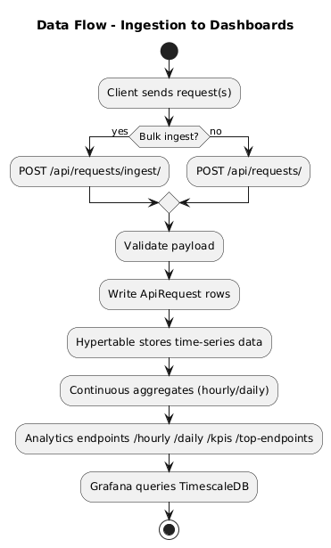

# Architecture

How the platform is put together — components, applications, data model, the
paths telemetry takes, and how it's delivered. For the feature-by-feature build
history see [`ROADMAP.md`](ROADMAP.md); for the infra layers see
[`../infra/README.md`](../infra/README.md).

## Logical runtime

A Django/DRF service is the core. It ingests telemetry (custom REST **and**
native OTLP), stores it in TimescaleDB, and serves analytics, a REST/JSON API,
and a first-party dashboard. Around it sit the LGTM observability stack,
Alertmanager, and the delivery/policy tooling.




Deployment topologies:
- **Single-node** (`docker/docker-compose.yml`) — everything on one host for local dev/demo.
- **Multi-node cluster** — DATA (TimescaleDB primary + replicas, pgBackRest, exporter),
  CONTROL (MinIO, Prometheus, Grafana, Alertmanager), APP (Django + Nginx TLS).
- **Kubernetes** — Helm chart + ArgoCD GitOps, provisioned by Terraform.

## Django applications

The project is split into focused Django apps, each owning one domain:

| App | Responsibility |
|---|---|
| `apm_platform/` | Project settings, URL routing, primary/replica DB router, tenant middleware, JWT/DRF config. |
| `observability/` | Core telemetry: REST ingestion + analytics, the `ApiRequest`/`Span`/`MetricPoint`/`LogRecord`/`Service`/`Issue` models, native **OTLP** ingestion (`otlp/`), service maps + anomaly detection + NL query (`analytics/`), the AI layer (`ai/`: Gemini + local Ollama embedders + LLM), and the dashboard template. |
| `tenancy/` | `Organization → Project → Environment`, hashed/rotatable API keys, RBAC, JWT auth, per-project quotas, and the Row-Level-Security middleware. |
| `notifications/` | The provider-pattern alert sink (Alertmanager webhook → channels), plus the incident workflow (timeline, ack/assign/resolve, MTTA/MTTR, postmortems). |
| `alerting/` | Tenant-defined `AlertRule`s (threshold + anomaly) and the scheduler that evaluates them and routes firings into the sink/incident pipeline. |
| `dora/` | Deployment records + the four DORA delivery metrics with performance bands. |

## Data model & storage

- **Time-series** (`ApiRequest`, `Span`, `MetricPoint`, `LogRecord`) live in
  **TimescaleDB hypertables** partitioned on `time`, with hourly/daily
  **continuous aggregates** for fast KPIs and a retention policy that drops raw
  chunks once the aggregates hold the history. Native columnar compression is
  *not* used: TimescaleDB refuses it on tables with row-level security, and
  tenant isolation wins over the storage saving.
- **Multi-tenancy** is shared-schema: every tenant row carries `project_id`,
  enforced by PostgreSQL **Row-Level Security** (permissive-when-unset policy;
  the tenant is bound to the DB session via a GUC). See
  [ADR 0001](adr/0001-multi-tenant-isolation.md).
- **Vectors** (`ApiRequestEmbedding`) use **pgvector** for semantic error search
  and grouping.
- **Read/write routing**: writes go to the primary; reads prefer replicas with a
  read-after-write TTL window.

## Telemetry ingestion paths

1. **Custom REST** — `POST /api/requests/ingest/` (batch), the original path.
2. **Native OTLP** — `/v1/traces`, `/v1/metrics`, `/v1/logs` over **HTTP (JSON +
   protobuf)** and a **gRPC** receiver on `:4317`. Tenant is resolved from the
   ingestion API key; **tail sampling** and per-tenant **rate limiting** are
   applied before storage. Server spans are also projected into the `ApiRequest`
   analytics model so existing KPIs keep working.

## Observability stack (LGTM)

- **Metrics** — Prometheus scrapes the app (`/metrics`), node-exporter,
  postgres-exporter, plus custom ingest metrics.
- **Logs** — structured JSON logs (with `trace_id`/`span_id`) shipped to Loki.
- **Traces** — OpenTelemetry → Collector → Tempo, cross-linked in Grafana.
- **Alerting** — Alertmanager (severity routing, inhibition) → the notification
  sink → incidents; SLO burn-rate + DR alert rules in `alert.rules.yml`.

## Delivery & infrastructure

- **Build/release** — CI lints, tests, scans (Trivy/CodeQL), builds and **signs**
  the image (Cosign keyless) with SBOM + provenance.
- **IaC** — Terraform provisions a local `kind` env or a reference AWS stack
  (VPC/EKS/RDS/S3); modules deploy the Helm chart with secrets injected from TF.
- **GitOps + CD** — Helm chart + ArgoCD; `deploy.yml` promotes tag → staging →
  approval → production with smoke tests and rollback.
- **Policy** — Kyverno admission policies verify Cosign signatures and enforce
  non-root / registry / resource / probe rules; the chart ships a restricted
  Pod Security context + optional NetworkPolicy.
- **Progressive delivery** — Argo Rollouts canary with Prometheus metric
  analysis (auto-promote / auto-rollback).
- **Secrets** — External Secrets Operator / Sealed Secrets / SOPS; no plaintext
  in git (gitleaks CI).
- **Reliability/DR** — pgBackRest hot/cold backups + automated restore
  verification (RPO/RTO metrics) + chaos drills.

## CI/CD workflows (`.github/workflows/`)

`ci` (lint/test/compose/audit) · `codeql` · `trivy` · `release` (build/sign/SBOM)
· `deploy` (staging→prod) · `dr-verify` (weekly restore test) · `gitleaks`
(secret scan) · `terraform` (fmt/validate/tflint/tfsec) · `policy` (Kyverno test).

## Repository layout (high level)

```
apm_platform/  observability/  tenancy/  notifications/  alerting/  dora/   # Django apps
docker/        # images + compose stacks + monitoring configs
deploy/        # Helm chart + ArgoCD applications
infra/         # terraform · policy (kyverno) · secrets · ansible   (see infra/README.md)
scripts/       # deploy, drills, test runners, cluster helpers
docs/          # architecture, case study, roadmap, ADRs, runbooks
report/        # academic report — LaTeX sources + compiled PDF (archived)
loadtest/      # k6 suite     postman/  configs/     Makefile  manage.py
```

Generated/local artifacts (`__pycache__/`, `*.sqlite3`, `.env*` secrets,
`configs/cluster/cluster.yml`, TLS material, Terraform state) are gitignored.
