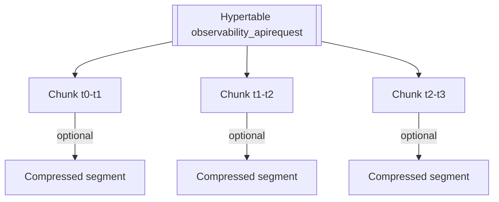

# Hypertable and chunking

```mermaid
flowchart TB
  Hypertable[[Hypertable observability_apirequest]]
  Hypertable --> Chunk1[Chunk t0-t1]
  Hypertable --> Chunk2[Chunk t1-t2]
  Hypertable --> Chunk3[Chunk t2-t3]
  Chunk1 -->|optional| Compress1[Compressed segment]
  Chunk2 -->|optional| Compress2[Compressed segment]
  Chunk3 -->|optional| Compress3[Compressed segment]
```
