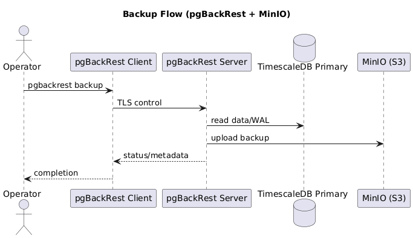
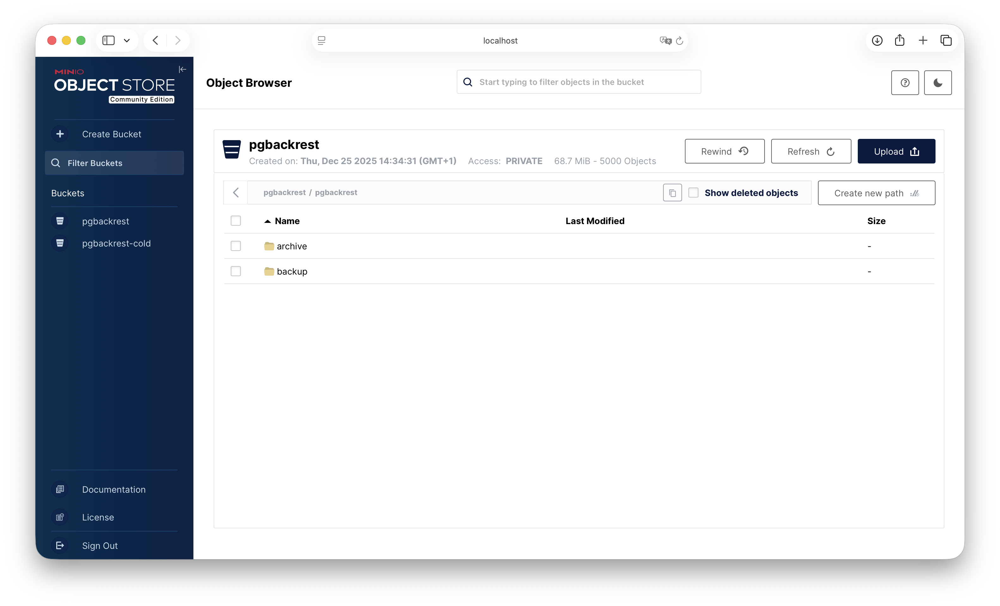

# 3. Application pratique

## 3.1 Securiser backend <-> base (roles)
Objectif: separer lecture/criture.
- `apm_writer` pour l'agent (write)
- `apm_reader` pour Grafana/analytics (read)

Lien projet:
- Roles SQL: `docker/initdb/001_roles.sql`
- Routing: `apm_platform/db_router.py`, `apm_platform/db_middleware.py`
- Settings: `apm_platform/settings.py` (DATABASES / READ_AFTER_WRITE_TTL)
- Env: `POSTGRES_APP_USER`, `POSTGRES_READONLY_USER` dans `.env.docker` et `docker/cluster/.env.cluster`

## 3.2 Programmation de backup (S3 hot/cold)
Hot storage: MinIO bucket `pgbackrest`
Cold storage: MinIO bucket `pgbackrest-cold` (future AWS Glacier)

Lien projet:
- pgBackRest config: `docker/backup/pgbackrest-client.conf`, `docker/backup/pgbackrest-server.conf`
- Cron schedule: `docker/backup/pgbackrest-cron.sh`
- MinIO init: `docker/minio/init.sh`
- Control stack: `docker/cluster/docker-compose.control.yml`

Planification (pgbackrest-cron.sh):
- Incr (repo1) chaque heure
- Diff (repo1) chaque jour a 01:00
- Full (repo1) chaque dimanche 01:05
- Full (repo2) premier dimanche du mois 02:00

Retention / chiffrement:
- repo1-retention-full=2, repo1-retention-diff=7 (hot)
- repo2-retention-full=12 (cold)
- repo1/2-cipher-type=aes-256-cbc (pass dans PGBACKREST_REPO*_CIPHER_PASS)
- archive-check=n et archive-mode-check=n (cold sans WAL)

Commandes:
```
make pgbackrest-info
make pgbackrest-check
make pgbackrest-full
make pgbackrest-full-repo2
```

## 3.3 Seeding avec Faker
Objectif: remplir la base avec donnees realistes.

Lien projet:
- Commande: `observability/management/commands/seed_apirequests.py`
- Helper: `scripts/seed_faker.sh`
- Make target: `make seed`

## 3.4 Simulation de panne + recovery
Objectif: valider resilience du cluster (primary, replicas, backup).

Lien projet:
- Drills: `scripts/drills/00_baseline.sh`, `01_primary_restore.sh`,
  `02_failover_replica.sh`, `03_minio_outage.sh`
- Tests: `scripts/step6_test.sh`

Scenario recommande (pas a pas):
1) Baseline:
   - `bash scripts/drills/00_baseline.sh`
2) Trafic continu (optionnel, via API):
   - `python manage.py seed_apirequests --count 2000 --via-api --insecure --batch-size 200`
3) Panne primaire + failover:
   - `CONFIRM=YES bash scripts/drills/02_failover_replica.sh`
4) Verification:
   - `python manage.py check_cluster_dbs`
   - `SELECT application_name, client_addr, state, sync_state FROM pg_stat_replication;`
5) Restore primaire (si besoin):
   - `CONFIRM=YES bash scripts/drills/01_primary_restore.sh`

## 3.5 Optimisation par indexes
Indexes utilises:
- Composite indexes (service/endpoint/time)
- Index partiel pour erreurs (status_code >= 500)
- Indexes pour KPIs (hourly/daily)

Lien projet:
- Index definitions: `observability/models.py`
- Migrations: `observability/migrations/0005_step5_indexes.py`,
  `observability/migrations/0007_task7_indexes.py`

## 3.6 Captures (backups et tests)
Flux de sauvegarde pgBackRest vers MinIO:


MinIO - bucket hot (pgbackrest):


MinIO - bucket cold (pgbackrest-cold):


Rapport de tests (Step 1):


Rapport de tests (Step 5):

